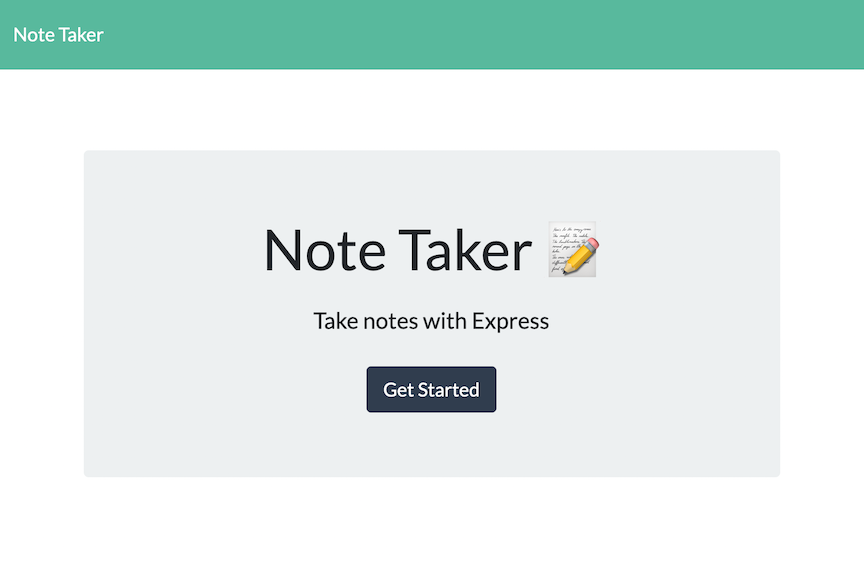

# Note Taker

  

  ## Description

  This application provides a simple page for users to make notes for anything they need to do or save for later reference. 
  Deployed through Heroku, it is not necessary for a user to clone this repository to their machine to use this application.

  

  ## Table of Contents

  * [Installation](#installation)
  * [Usage](#usage)
  * [Contributing](#contributing)
  * [Testing](#testing)
  * [License](#license)
  * [Questions](#questions)
  
  ## Installation

  If you would like to clone the repository and run the application from the command line, use these steps:
  1. Clone the repository
  2. Navigate to the folder containing the application
  3. From the command line enter `npm install express --save`

  ## Usage

  Click 'Get Started' to open the Notes page. There you can enter the title and text of the note and click the save icon at the top right of the page.

  ## Contributing

  This project is not accepting contributions at this time.

  ## License

  This project is licensed with the MIT License.

  ## Questions

  If you have questions about this project please contact me at [crawleyj2@gmail.com](mailto:crawleyj2@gmail.com).
  More of my work can be found on GitHub at [crawleyj2](https://github.com/crawleyj2)